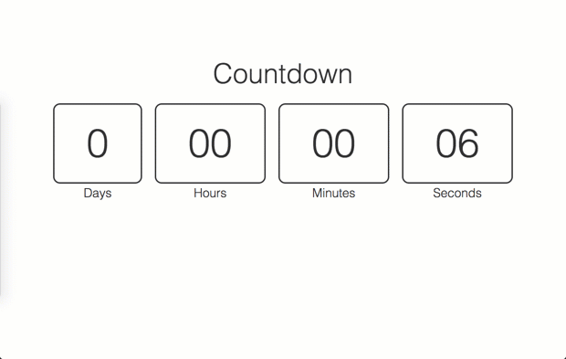

# Quick Countdown
Add countdown by URL variables

Check it out
https://chancesmith.github.io/quick-countdown/

## Example
https://chancesmith.github.io/quick-countdown/?mins=5&title=Time%20until%20CO:de

## Countdown variables
- `?time=0700` 7:00am or `?time=`
- `?days=4`
- `?hours=2`
- `?mins=7`

## Extras
- `?title=Countdown until Javascript Meetup`
- `?message=Countdown complete!`

## Todos
- [X] add success message after timer stops
- [X] add custom success message with URL variable
- [X] add custom title with URL variable
- [X] fix default & add intro instructions if no URL variables set
- [X] add visual of time left on countdown
- [ ] `?date=2017-05-02&hours=14&mins=35` 2:35pm on 05-02-2017
- [ ] `?date=2017-05-02`
- [X] `?time=1630` 4:30pm
- [ ] remove blocks if section starts w/ zero (make more minimal)
- [ ] remove blocks once section reaches zero (extra minimal)
– [ ] fix `?time` to show the countdown tomorrow if already passed today
– [ ] only shows progress background for the last 60secs, maybe?